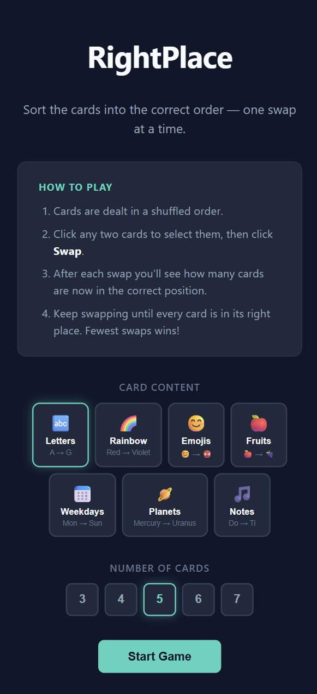
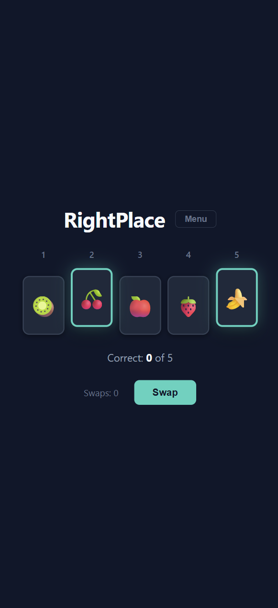

# RightPlace

A browser-based card-swapping puzzle game. Sort shuffled cards into the correct order — one swap at a time.

**[Play it live →](https://kuanghe-dev.github.io/rightplace-web/)**

<table>
  <tr>
    <td></td>
    <td></td>
  </tr>
</table>

## How to Play

1. Choose what to put on the cards and how many (3–7).
2. Cards are dealt in a shuffled order. Your goal is to sort them correctly.
3. Click two cards to select them, then click **Swap**.
4. After each swap you see how many cards are in the right position.
5. Keep swapping until all cards are in order. Fewest swaps wins!

## Card Types

| Type | Correct order |
|---|---|
| Letters | A → G |
| Rainbow | Red → Violet (spectrum order) |
| Emojis | 😊 → 😡 |
| Fruits | 🍎 → 🍇 |
| Weekdays | Mon → Sun |
| Planets | Mercury → Uranus (distance from Sun) |
| Notes | Do → Ti (solfège scale) |

## Development

```bash
npm install
npm run dev      # http://localhost:5173/rightplace-web/
npm run build    # production build → dist/
npm run deploy   # build + push to gh-pages branch
```

## Tech Stack

- React 18 + Vite
- Plain CSS with custom properties
- `canvas-confetti` for the win animation
- Deployed to GitHub Pages via GitHub Actions
